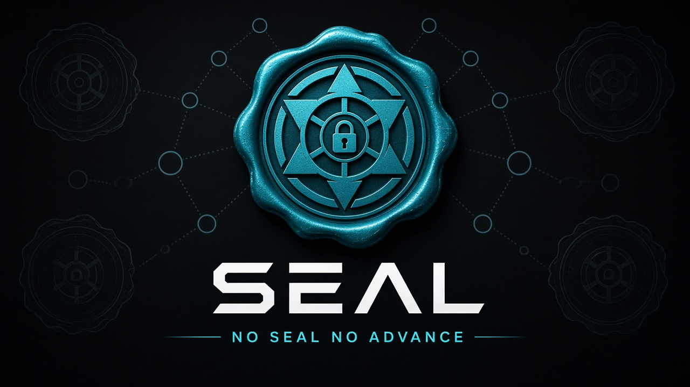
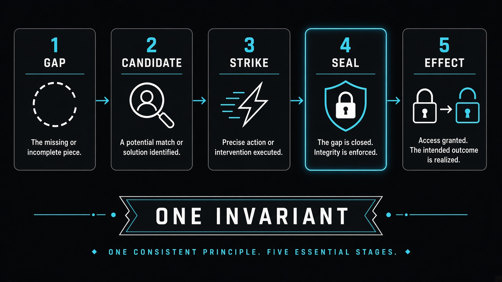
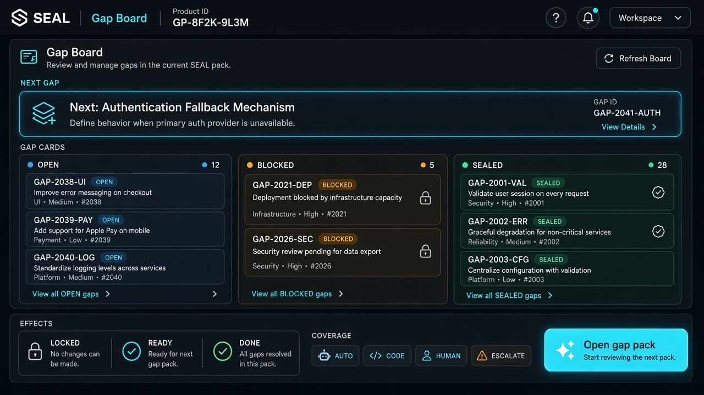
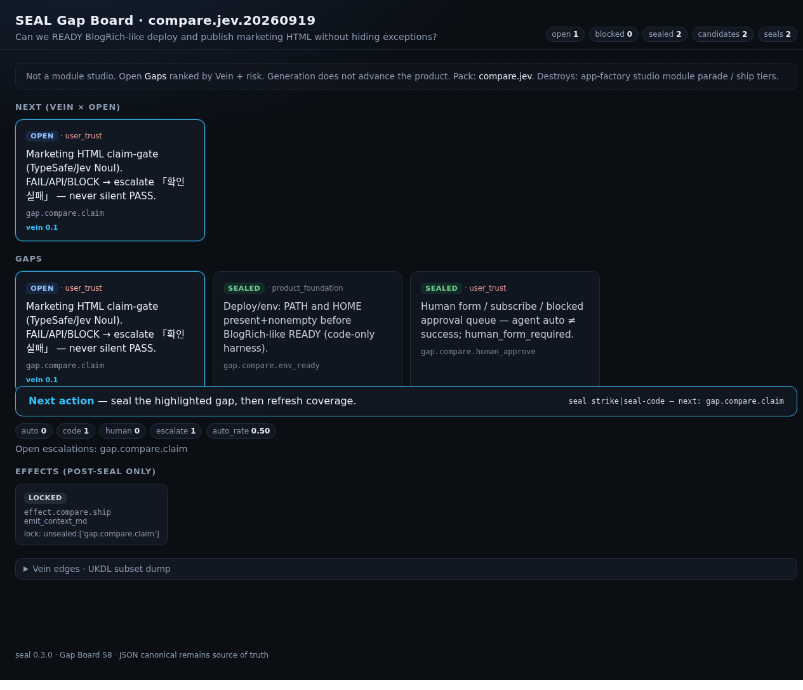
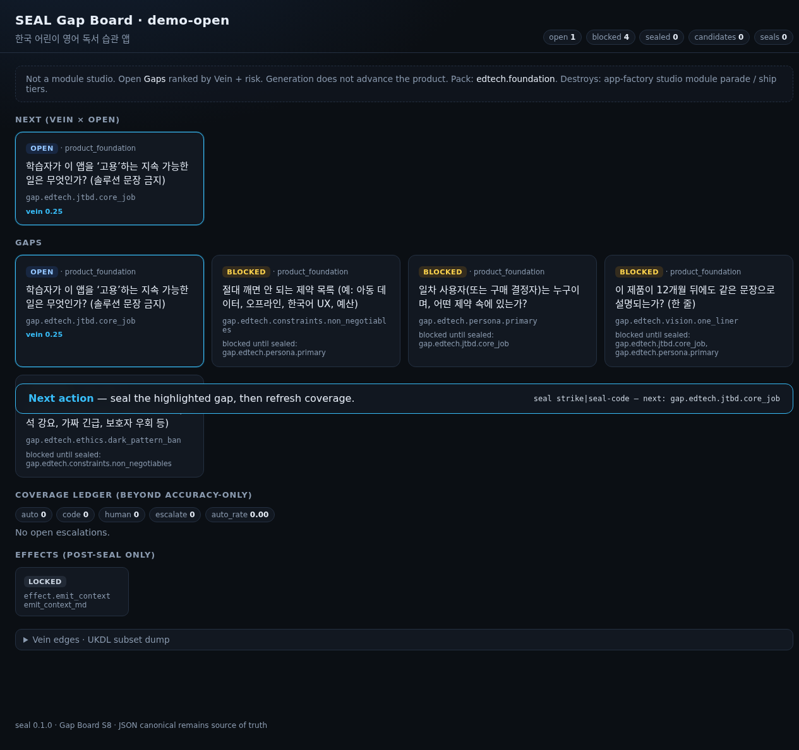

<p align="center">
  
</p>

<p align="center">
  <a href="#start-in-30-seconds"><strong>▶ Start in 30 seconds</strong></a>
  &nbsp;·&nbsp;
  <a href="#see-the-board"><strong>See the Board</strong></a>
  &nbsp;·&nbsp;
  <a href="#why-this-wins"><strong>Why this wins</strong></a>
  &nbsp;·&nbsp;
  <a href="docs/BEYOND-JEV.md"><strong>Beyond Jev</strong></a>
  &nbsp;·&nbsp;
  <a href="#worked-compare-jev"><strong>SEAL vs Jev log</strong></a>
  &nbsp;·&nbsp;
  <a href="https://github.com/Reasonofmoon/seal/tree/main/examples/public-repos"><strong>Public proof</strong></a>
</p>

<p align="center">
  
  
  
  
</p>

---

## The product brain is a sealed graph

**SEAL** (Seal · Evidence · Atomic Lock) is a workflow kernel.  
Generation can fill **Candidates**. Only a **Seal** advances the product. **Effects** (CONTEXT, codegen, deploy) stay locked until seals — and coverage — clear.

**Fleet harness (v0.3.7+):** run `scripts/harness/*.sh` from Herdr plans — never pane prompts ([COVERAGE-POLICY.md](docs/COVERAGE-POLICY.md)).

> Jev answers questions.  
> **SEAL answers whether the world may change — and refuses to hide the exception queue.**

---

## Kernel (one invariant · five stages)

<p align="center">
  
</p>

| You see | You do | Affordance |
|---------|--------|------------|
| **Gap** | Open a typed hole | `seal open` / `seal init` |
| **Candidate** | Propose a fill | `seal fill` |
| **Strike** | Judge under locks | `seal strike` or `seal seal-code` |
| **Seal** | Append-only accept | stamped on the graph |
| **Effect** | Unlock side effects | `seal effect` (blocked if escalations open) |

---

## See the Board

<p align="center">
  
</p>


<p align="center">
  
</p>
<p align="center"><em>Live render: compare.jev — Next=claim escalate, effect.ship locked (for readers who cannot run board.html JS on GitHub)</em></p>
<p align="center">
  
</p>
<p align="center"><em>Live render: demo-open — open + blocked gap cards</em></p>

**Affordance map**

| Surface | What it invites |
|---------|-----------------|
| **Next** (cyan) | Do this gap now — Vein × risk ranked |
| **Open / Blocked / Sealed** | Status at a glance — no module parade |
| **Coverage pills** | Auto · Code · Human · Escalate — nothing hidden |
| **Effects** | Locked / Ready / Done — post-seal only |
| **Open gap pack** | Primary CTA — start a product |

Live HTML boards in-repo (open via local server — GitHub’s HTML preview does **not** run the dashboard JS):  
[`examples/compare-jev/run/board.html`](examples/compare-jev/run/board.html) · [`examples/demo-open/board.html`](examples/demo-open/board.html) · [`examples/readmaster-habit/board.html`](examples/readmaster-habit/board.html) · [`examples/public-repos/langchain/board.html`](examples/public-repos/langchain/board.html)

```bash
PYTHONPATH=src python3 src/seal/cli.py board --graph examples/readmaster-habit/graph.json --out /tmp/board.html
open /tmp/board.html   # or xdg-open
```

---

## Agent parade vs SEAL

<p align="center">
  
</p>

| | Agent / toolkit parade | **SEAL** |
|--|------------------------|----------|
| Unit of progress | Step ran / tokens streamed | **Seal recorded** |
| Exception queue | Hidden in “94% accuracy” | **Coverage ledger** |
| Deploy unlock | Hope + PR description | **Effect gate** |
| Learning | Prompt Hebbian | **Vein on seals only** |

---

## Coverage Gate (beyond Jev)

<p align="center">
  
</p>

Developers warned: **schema-valid ≠ true**, **accuracy without coverage is dishonest**, **mint ≠ product brain**.  
SEAL stamps every seal `auto | code | human | escalate` and can keep Effects **locked** while escalations remain open.

```bash
seal escalate --graph G --gap gap.… --reason "low confidence"
seal coverage --graph G
```

→ [docs/BEYOND-JEV.md](docs/BEYOND-JEV.md) · [docs/COVERAGE-POLICY.md](docs/COVERAGE-POLICY.md)

---


<a id="worked-compare-jev"></a>

## Worked compare: SEAL vs Jev (2026-09-19 KST)

We ran the **same** BlogRich-like ship question through Jev mint and through SEAL.

Full log: [`examples/compare-jev/COMPARE.md`](examples/compare-jev/COMPARE.md) · board: [`examples/compare-jev/run/board.html`](examples/compare-jev/run/board.html) (open via local `python3 -m http.server` — GitHub file view does not run the dashboard JS)

<p align="center">
  
</p>
<p align="center">
  
</p>

| Observation | Jev-only | SEAL (real run) |
|-------------|----------|-----------------|
| Forbidden copy “명문대 합격 보장” | **BLOCK** noul=0.99 (jev-1.13.0) — stdout ends | Same mint via harness → **open escalate** on `gap.compare.claim` |
| Clean copy | **PASS** noul=0.04 | Documented; **not** used to unlock ship |
| Env `PATH`/`HOME` | Not a mint concern | Sealed `code` with `env-ready-done.md` |
| Blocked approval / form | No durable queue | `human_form_pending` · adopt=`defer` · never auto-click |
| Ship / READY | PASS mint ≠ permission to change the world | `effect.compare.ship` **locked** — `unsealed:['gap.compare.claim']` |

**Coverage ledger:** seals=2 · code=1 · escalate=1 · auto_rate=0.5 · escalate_open=`claim` · human_form_pending=`human_approve`.

**Falsifiable takeaway:** Jev judged the claim correctly; SEAL refused to ship while the exception queue was open. If the board ever shows ship `ready` while claim is still open, this claim is wrong — reopen the graph.

**Dashboard check (2026-09-19):** Gap Board had a JS bug (`const esc` shadowed the escape helper) so cards did not paint; fixed in v0.3.9. Live verify on `:8877` — compare + demo-open boards render Next/gaps/coverage/locked effect + sticky CTA.

---

<a id="start-in-30-seconds"></a>

## Start in 30 seconds

```bash
git clone https://github.com/Reasonofmoon/seal.git && cd seal
bash scripts/demo.sh
```

**What you get:** open pack → `seal-code` on first gap → coverage ledger → Gap Board path printed.

| Intent | Command |
|--------|---------|
| Scaffold a product | `PYTHONPATH=src python3 src/seal/cli.py init --dir .seal --id myapp --idea "…"` |
| See next hole | `… status --graph .seal/graph.json` |
| Deterministic seal | `… seal-code --graph .seal/graph.json --gap … --ok` |
| Render board | `… board --graph .seal/graph.json --out board.html` |
| Merge/deploy gate | copy [recipes/github-seal-check.md](recipes/github-seal-check.md) |
| CI template | copy [recipes/github-actions-seal-ci.yml](recipes/github-actions-seal-ci.yml) → `.github/workflows/` |

Coding agents: read [AGENTS.md](AGENTS.md) first.

---

<a id="why-this-wins"></a>

## Why this wins (falsifiable)

| Criterion | Pipelines | Spec factories | Jev alone | **SEAL** |
|-----------|-----------|----------------|-----------|----------|
| Advance gate | ✗ | ✗ | ✗ | **✓** |
| Lock locality | ✗ | late audit | n/a | **✓ on Gaps** |
| Coverage visible | ✗ | ✗ | caller’s job | **✓ ledger** |
| Durable SSOT | weak | drifts | none | **Seal Graph** |
| Public counterexamples | — | — | — | **[scored](examples/public-repos/)** |

Full argument: [docs/WHY-SEAL.md](docs/WHY-SEAL.md)

### Public proof (other people’s famous repos)

| Subject | Hardest fail | Open |
|---------|--------------|------|
| [langchain-ai/langchain](https://github.com/langchain-ai/langchain) | `advance_gate` | [case](examples/public-repos/langchain/) |
| [crewAIInc/crewAI](https://github.com/crewAIInc/crewAI) | `advance_gate` | [case](examples/public-repos/crewai/) |
| [microsoft/autogen](https://github.com/microsoft/autogen) | `durable_ssot` | [case](examples/public-repos/autogen/) |
| [vercel/ai](https://github.com/vercel/ai) | `advance_gate` | [case](examples/public-repos/vercel-ai/) |
| [typesafe-ai/typesafe-sdk-python](https://github.com/typesafe-ai/typesafe-sdk-python) | mint ≠ brain | [case](examples/public-repos/typesafe-sdk/) |

---

## Layout

```
docs/assets/     hero · kernel · board UI · parade · coverage
packs/           edtech · audit.workflow-class · blogrich · publish
src/seal/        kernel · vein · coverage · board · cli
examples/        sealed proofs + Gap Board HTML
scripts/demo.sh  one command
recipes/         CI + merge gate
```

Python kernel: **zero runtime deps**. Node optional for TypeSafe mint only.

---

## License

MIT · Reason of Moon
