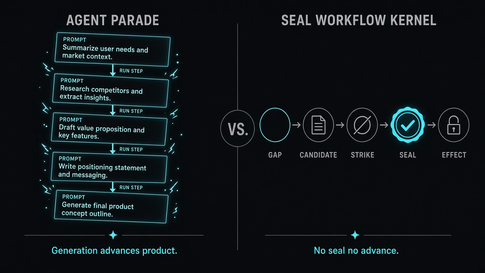
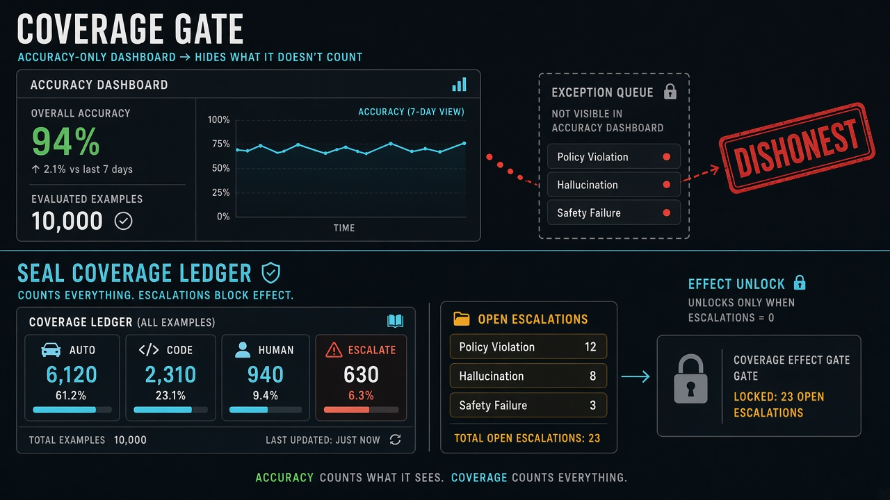

# SEAL

### No seal, no advance.

**SEAL** (Seal · Evidence · Atomic Lock) is a workflow kernel for building products with AI: the product may only move forward when claims are **sealed** under explicit locks.

It is **not** another agent pipeline, not an executable knowledge document, and not “Jev with a UI.”  
[Jev](https://typesafe.ai) is a decision mint. SEAL is the **graph that decides what those decisions are allowed to unlock** — and it **shows the exception queue**.

[Why SEAL](docs/WHY-SEAL.md) · [Beyond Jev](docs/BEYOND-JEV.md) · [Public cases](docs/CASES-PUBLIC.md) · [Coverage policy](docs/COVERAGE-POLICY.md) · [Manifesto](docs/SEAL-FRAMEWORK.md)

---

## Visual: Agent parade vs SEAL

<p align="center">
  
</p>

**Left — Agent parade:** each `RUN STEP` succeeds and the “product” moves. Generation *is* progress.  
**Right — SEAL:** `Gap → Candidate → Strike → Seal → Effect`. **No seal, no advance.** Effects stay locked until seals (and coverage policy) clear.

---

## Visual: Coverage Gate (beyond Jev)

<p align="center">
  
</p>

Developers reviewing Jev warned that **accuracy without coverage is dishonest**. SEAL stamps every seal with `auto | code | human | escalate`, prints the ledger, and can **keep Effects locked** while escalations remain open.

```bash
seal escalate --graph G --gap gap.… --reason "low confidence"
seal coverage --graph G
# Effect unlock requires coverage_policy (default: no open escalations)
```

---

## Worked public example (famous repos)

We score **other people’s** starred public repositories as workflow classes — not our private apps.

| Subject | Hardest fail | Board |
|---------|--------------|-------|
| [langchain-ai/langchain](https://github.com/langchain-ai/langchain) (~147k★) | `advance_gate` | [case](examples/public-repos/langchain/) |
| [crewAIInc/crewAI](https://github.com/crewAIInc/crewAI) (~59k★) | `advance_gate` | [case](examples/public-repos/crewai/) |
| [microsoft/autogen](https://github.com/microsoft/autogen) (~61k★) | `durable_ssot` | [case](examples/public-repos/autogen/) |
| [vercel/ai](https://github.com/vercel/ai) (~27k★) | `advance_gate` | [case](examples/public-repos/vercel-ai/) |
| [typesafe-ai/typesafe-sdk-python](https://github.com/typesafe-ai/typesafe-sdk-python) | mint ≠ product brain | [case](examples/public-repos/typesafe-sdk/) |

Open any `board.html` in those folders — Vein-ranked gaps, seals, coverage, effects. Method: pack `audit.workflow-class` · [CASES-PUBLIC.md](docs/CASES-PUBLIC.md).


## The door beyond Jev

Developers praised Jev for typed, calibrated decisions — and warned that **schema-valid ≠ true**, that **accuracy without coverage** is dishonest, and that a mint is not a product brain. SEAL’s answer is the **Coverage Gate** + **advance gate**: see [docs/BEYOND-JEV.md](docs/BEYOND-JEV.md).

Famous public repos scored as workflow classes: [examples/public-repos](examples/public-repos/).

## Differentiation in one screen

| | Agent / module pipelines | Spec factories | UKDL L3–L5 | Jev / System One | **SEAL** |
|--|--------------------------|----------------|------------|------------------|----------|
| Unit of progress | Step ran | Doc written | Node executed | Decision returned | **Seal recorded** |
| Late audit boss fight | Common | Common | N/A | N/A | **Destroyed** (locks on Gaps) |
| Trust-band enforcement | Rare | Rare | N/A | Caller’s job | **Kernel policy** |
| Durable product brain | Weak | Drifts | Living-doc myth | None | **Seal Graph** |
| Learning signal | Token / prompt chains | — | — | — | **Sealed transitions only (Vein)** |
| Human-readable form | Prompts | Markdown | Full UKDL | API JSON | **UKDL subset that cannot execute** |

If generation alone advances your “product,” you do not have SEAL — you have a parade.

---

## Kernel loop

```
Gap → Candidate → Strike → Seal → Effect
```

1. **Gap** — typed hole; accept locks already attached  
2. **Candidate** — proposed fill (human / import / generative)  
3. **Strike** — atomic judgment batch (heuristic or TypeSafe/Jev)  
4. **Seal** — append-only accept  
5. **Effect** — CONTEXT, codegen, deploy… **only after** required seals  

```bash
seal open   --idea "…" --pack edtech.foundation
seal fill   --gap … --text "…"
seal strike --gap … --candidate … --provider heuristic|typesafe
seal status          # open / blocked / sealed / next (Vein)
seal effect --id …   # refused until seals unlock it
seal board  --out board.html
seal coverage --graph …
seal escalate --gap … --reason "…"
seal seal-code --gap … --ok
seal attach-pack --pack blogrich.trust
seal evidence --kind github_repo --ref https://github.com/…
```

---

## Quickstart

```bash
git clone https://github.com/Reasonofmoon/seal.git
cd seal
PYTHONPATH=src python3 -m unittest discover -s tests -v

# Open a pack and inspect the board
PYTHONPATH=src python3 src/seal/cli.py open \
  --id demo --idea "Korean kids English reading habit app" \
  --pack edtech.foundation --out /tmp/demo.json
PYTHONPATH=src python3 src/seal/cli.py board --graph /tmp/demo.json --out /tmp/board.html
```

`user_trust` / `irreversible` gaps **refuse heuristic**. For those strikes:

```bash
cp .env.example .env   # set TYPESAFE_API_KEY
npm install            # optional: @typesafe-ai/sdk
export TYPESAFE_API_KEY=…
# optional: export NODE_PATH="$(pwd)/node_modules"
```

---

## In-repo proofs

| Example | Shows |
|---------|--------|
| [`examples/demo-open`](examples/demo-open) | Vein-ranked next Gap; blocked dependents |
| [`examples/readmaster-habit`](examples/readmaster-habit) | Foundation 5/5 sealed + CONTEXT effect |
| [`examples/audit-conquest`](examples/audit-conquest) | Weak AF spec fails rubric Gaps under locks |
| [`examples/s5-implement-unlock`](examples/s5-implement-unlock) | Codegen locked until passport + context |

---

## Status (S1–S8)

Schema · Gap packs · Strike mint · TypeSafe on trust bands · audit-spec conquest · post-seal Effects · Vein · UKDL subset · Gap Board.  
See [`docs/S0-S8-STATUS.md`](docs/S0-S8-STATUS.md).

---

## Layout

```
schemas/     seal-graph + lock-policy
packs/       edtech.foundation · conquest.audit-spec
src/seal/    kernel · vein · ukdl subset · board · cli
examples/    sealed proofs + Gap Board HTML
docs/        manifesto · why · phase notes
tests/       22 unittest cases
```

Python kernel: **zero runtime dependencies**. Node is optional and only for TypeSafe mint.

---

## License

MIT · Reason of Moon
